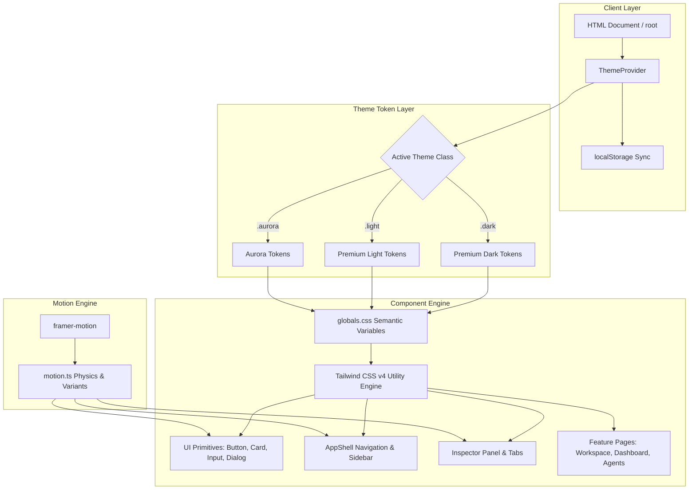

# Design System Architecture: Jarvis AIOS

## Layer Descriptions

1. **Client & Persistence Layer**: `ThemeProvider` initializes the saved theme from `localStorage` without FOUC, attaching `.dark`, `.light`, or `.aurora` class to `document.documentElement`.
2. **Semantic Design Token Layer**: HSL CSS variables mapping background, surface, text, border, accent, glass, and shadow specifications.
3. **Component Engine**: Pure component layer utilizing semantic tokens. No hardcoded hex values.
4. **Motion Engine**: Framer Motion standardized springs and eases providing desktop-grade micro-interactions.
